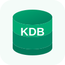

# Lakeflow KX KDB+ HDB connector

Ingest immutable, splayed KDB+ HDB tables from a Unity Catalog Volume into
Delta streaming tables. The connector reads HDB files locally through PyKX;
it does not require a running q process.



## Capabilities

| Capability | Support |
| --- | --- |
| Source | Splayed HDB under `/Volumes/...` |
| Table discovery | Any table directory found below a date partition |
| Ingestion | Append-only |
| Streaming offset | Latest completed HDB date partition |
| Parallelism | One Spark partition per `(date, symbol)` |
| Schema | Inferred from KDB metadata through PyKX |
| Serverless Lakeflow | Validated |

Snapshot ingestion, date-only task partitioning, and paths that are not
visible to every executor are not supported.

## Prerequisites

- A Unity Catalog Volume containing the HDB.
- `READ VOLUME` for the Lakeflow pipeline identity.
- PyKX in the pipeline environment, or a configured PyKX wheel/package spec.
- A valid KX license.
- KDB-X already available, staged as an offline bundle, or installable with a
  secret-backed KX installer token.

PyKX uses a dual-license model, including commercial terms for its `q.so`
components. Review the [KDB-X Python license terms][kx-license] and
[installation requirements][kx-install] before using this connector. PyKX,
`q.so`, KDB-X, the KX installer, offline bundles, and KX license files are not
bundled or redistributed with the connector. Each user must obtain and accept
the applicable KX terms and provide their own licensed runtime.

[kx-license]: https://code.kx.com/pykx/4.0/license.html
[kx-install]: https://code.kx.com/pykx/4.0/getting-started/installing.html

## HDB layout

```text
/Volumes/<catalog>/<schema>/<volume>/hdb/
├── sym
├── 2024.01.01/
│   ├── TRADES/
│   └── QUOTES/
└── 2024.01.02/
    ├── TRADES/
    └── QUOTES/
```

The root `sym` file provides symbol enumeration indices. Date names must use
`YYYY.MM.DD`. Table discovery is case-insensitive and exposes logical
lower-case names such as `trades` and `quotes`.

## Create the connection

Create a Generic Lakeflow Connect connection with `sourceName: kx_kdb` and
the parameters from `connector_spec.yaml`.

Minimum configuration when PyKX/KDB-X and the license are already staged:

```yaml
hdb_root_path: /Volumes/<catalog>/<schema>/<volume>/hdb
license_volume_path: /Volumes/<catalog>/<schema>/<volume>/keys
```

For online bootstrap, store the bearer token and base64 license in Databricks
secrets and expose them through secret-backed connection options:

```sql
CREATE CONNECTION kx_hdb TYPE GENERIC_LAKEFLOW_CONNECT
OPTIONS (
  sourceName 'kx_kdb',
  hdb_root_path '/Volumes/<catalog>/<schema>/<volume>/hdb',
  license_volume_path '/Volumes/<catalog>/<schema>/<volume>/keys',
  kdbx_install_mode 'online',
  kdbx_install_bearer_token secret('<scope>', '<installer-token-key>'),
  kdbx_license_b64 secret('<scope>', '<license-key>')
);
```

Do not place bearer tokens or license contents directly in source control or
pipeline specifications.

## Connection parameters

| Parameter | Required | Description |
| --- | --- | --- |
| `hdb_root_path` | Yes | HDB root containing `sym` and date directories |
| `license_volume_path` | Yes | KX license/runtime working directory |
| `kdbx_install_mode` | No | `auto` (default), `offline`, or `online` |
| `kdbx_offline_bundle_path` | No | Explicit KDB-X air-gapped bundle; use `l64arm-bundle.zip` on current serverless ARM64 and `l64-bundle.zip` on x86_64 |
| `kdbx_license_file_path` | No | Existing license file or directory |
| `kdbx_install_bearer_token` | No | Secret-backed installer token |
| `kdbx_license_b64` | No | Secret-backed base64 license |
| `kdbx_secret_scope` | No | Legacy secret-scope lookup |
| `kdbx_install_bearer_secret_key` | No | Legacy token key |
| `kdbx_license_b64_secret_key` | No | Legacy license key |
| `pykx_install_spec` | No | PyKX wheel path or package spec |
| `discovery_sample_dates` | No | Dates sampled during discovery; `0` scans all |

## Table options

| Option | Default | Description |
| --- | --- | --- |
| `start_date` | First date | Inclusive partition filter |
| `end_date` | Last date | Inclusive partition filter |
| `ingestion_mode` | `append` | Only `append` is supported |
| `partition_strategy` | `date_sym` | Only `date_sym` is supported |
| `sym_column` | `sym` | Physical enumerated symbol column |
| `partition_conversion_mode` | `pandas` | `pandas`, `arrow_pandas`, or `arrow_direct` |

Example table selection:

```json
{
  "connection_name": "kx_hdb",
  "objects": [
    {
      "table": {
        "source_table": "trades",
        "destination_table": "trades_raw",
        "table_configuration": {
          "start_date": "2024.01.01",
          "end_date": "2024.12.31",
          "partition_strategy": "date_sym"
        }
      }
    },
    {
      "table": {
        "source_table": "quotes",
        "destination_table": "quotes_raw",
        "table_configuration": {
          "sym_column": "optionId"
        }
      }
    }
  ]
}
```

## Read model

1. The driver discovers selected dates and loads the root symbol enumeration.
2. `get_partitions()` emits JSON-serializable
   `{date_partition, sym, sym_index}` descriptors.
3. Each executor filters the configured symbol column by integer enumeration
   index.
4. Splayed columns are read in 10,000-row slices and converted to Spark rows.
5. A committed date offset prevents completed HDB dates from being read again.

See `kx_kdb_api_doc.md` for the complete source, schema, offset, and runtime
contract.

## Testing

Offline CI uses the same pattern as the community HL7 v2 Volume connector:
a temporary HDB-shaped directory plus deterministic replacements for the
PyKX boundary. The production filesystem discovery, partition planning,
offset, schema conversion, and row contracts still execute.

Live validation requires a licensed KDB-X environment and must cover multiple
tables, dates, symbols, restart/resume behavior, and a large symbol partition.
